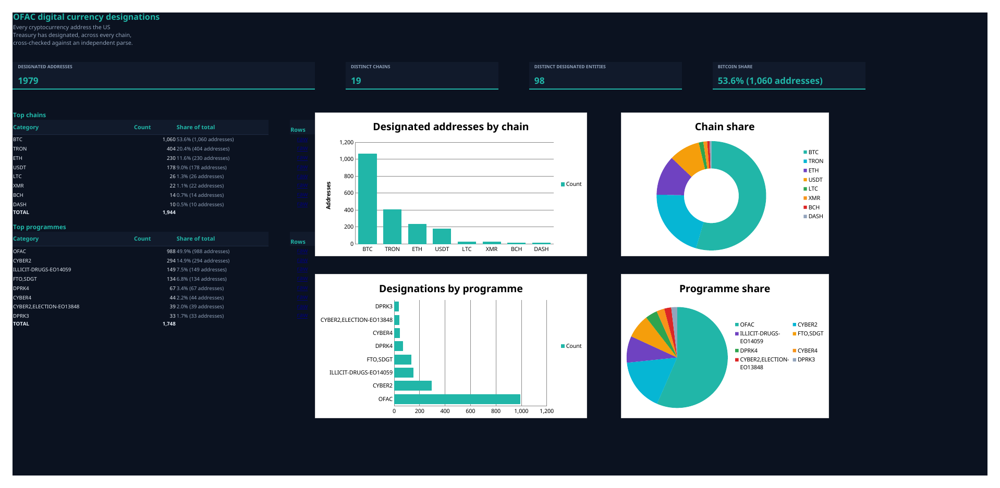
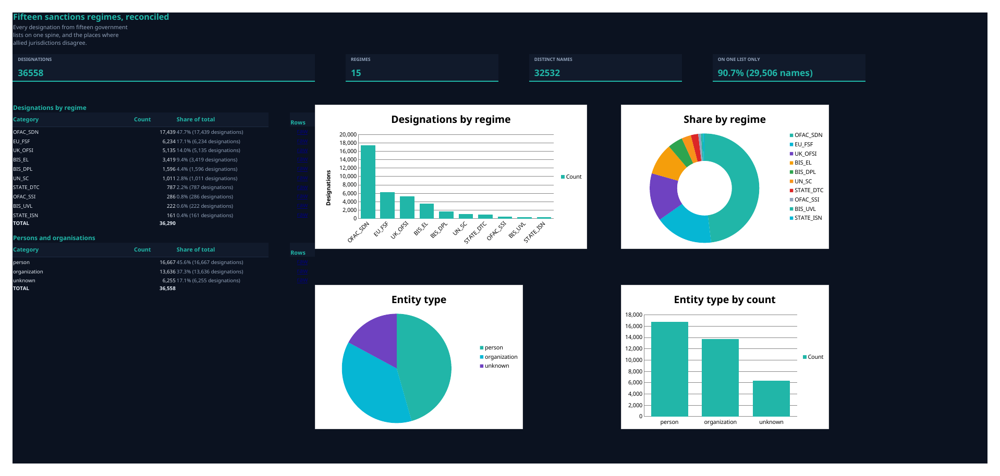
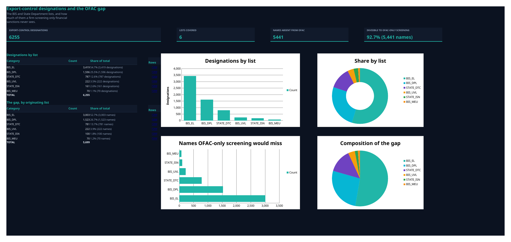
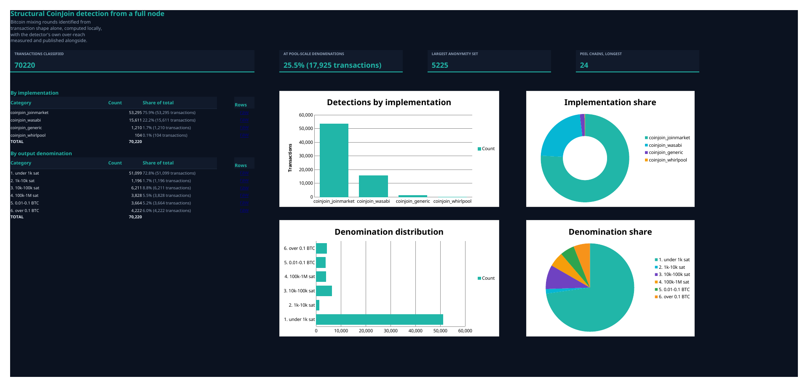
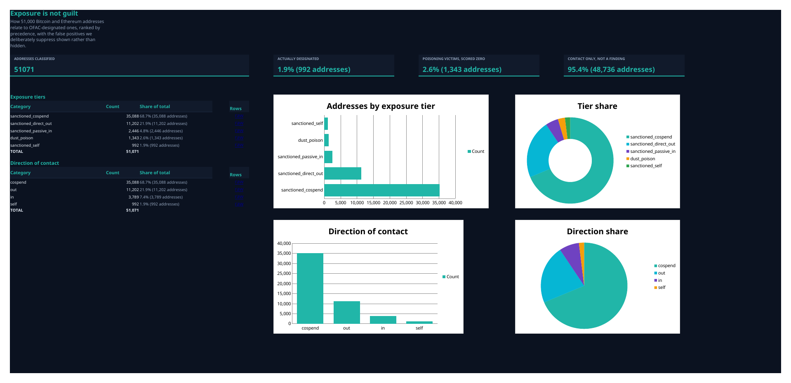
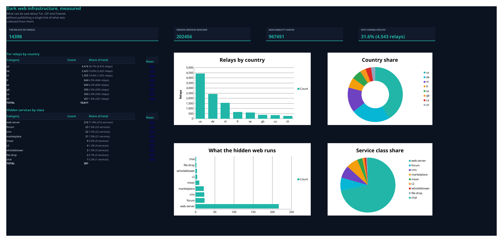

# Nexus Prism — public datasets

[](https://doi.org/10.5281/zenodo.22694724)

Six spreadsheet workbooks built from public-domain government records, from a
Bitcoin archival node we operate ourselves, and from our own dark-web
infrastructure measurements. Every summary figure in them is a live formula
pointing back at the rows it came from, so you can click any number and trace
it rather than taking our word for it.

Free to use, quote and republish under CC BY 4.0. No signup, no licence key,
no email wall.

---

## Download the files

**The workbooks are release assets, not files in this repository.** Browsing the
repo shows you this page and the chart images only — the links below are the
actual spreadsheets.

| Dataset | Practitioner | Compliance | PDF |
|---|---|---|---|
| 1. OFAC digital currency designations | [.ods](../../releases/latest/download/nexus_prism_ofac_crypto_practitioner.ods) · [.xlsx](../../releases/latest/download/nexus_prism_ofac_crypto_practitioner.xlsx) | [.ods](../../releases/latest/download/nexus_prism_ofac_crypto_compliance.ods) · [.xlsx](../../releases/latest/download/nexus_prism_ofac_crypto_compliance.xlsx) | [.pdf](../../releases/latest/download/nexus_prism_ofac_crypto_compliance.pdf) |
| 2. Fifteen sanctions regimes | [.ods](../../releases/latest/download/nexus_prism_sanctions_regimes_practitioner.ods) · [.xlsx](../../releases/latest/download/nexus_prism_sanctions_regimes_practitioner.xlsx) | [.ods](../../releases/latest/download/nexus_prism_sanctions_regimes_compliance.ods) · [.xlsx](../../releases/latest/download/nexus_prism_sanctions_regimes_compliance.xlsx) | [.pdf](../../releases/latest/download/nexus_prism_sanctions_regimes_compliance.pdf) |
| 3. Export control and the OFAC gap | [.ods](../../releases/latest/download/nexus_prism_export_control_practitioner.ods) · [.xlsx](../../releases/latest/download/nexus_prism_export_control_practitioner.xlsx) | [.ods](../../releases/latest/download/nexus_prism_export_control_compliance.ods) · [.xlsx](../../releases/latest/download/nexus_prism_export_control_compliance.xlsx) | [.pdf](../../releases/latest/download/nexus_prism_export_control_compliance.pdf) |
| 4. Structural CoinJoin detection | [.ods](../../releases/latest/download/nexus_prism_coinjoin_node_practitioner.ods) · [.xlsx](../../releases/latest/download/nexus_prism_coinjoin_node_practitioner.xlsx) | [.ods](../../releases/latest/download/nexus_prism_coinjoin_node_compliance.ods) · [.xlsx](../../releases/latest/download/nexus_prism_coinjoin_node_compliance.xlsx) | [.pdf](../../releases/latest/download/nexus_prism_coinjoin_node_compliance.pdf) |
| 5. Exposure is not guilt | [.ods](../../releases/latest/download/nexus_prism_exposure_practitioner.ods) · [.xlsx](../../releases/latest/download/nexus_prism_exposure_practitioner.xlsx) | [.ods](../../releases/latest/download/nexus_prism_exposure_compliance.ods) · [.xlsx](../../releases/latest/download/nexus_prism_exposure_compliance.xlsx) | [.pdf](../../releases/latest/download/nexus_prism_exposure_compliance.pdf) |
| 6. Dark web infrastructure | [.ods](../../releases/latest/download/nexus_prism_darkweb_infra_practitioner.ods) · [.xlsx](../../releases/latest/download/nexus_prism_darkweb_infra_practitioner.xlsx) | [.ods](../../releases/latest/download/nexus_prism_darkweb_infra_compliance.ods) · [.xlsx](../../releases/latest/download/nexus_prism_darkweb_infra_compliance.xlsx) | [.pdf](../../releases/latest/download/nexus_prism_darkweb_infra_compliance.pdf) |

**Verify what you got:**
[`SHA256SUMS`](../../releases/latest/download/SHA256SUMS)

```bash
sha256sum -c SHA256SUMS --ignore-missing
```

Or take everything at once:

```bash
gh release download --repo quinn-defense-systems/nexus-prism-datasets --clobber
sha256sum -c SHA256SUMS --ignore-missing
```

These links always point at the newest release, so a bookmark does not go stale.
Details of the variants are in [Formats](#formats) below.

---

## Why these exist

We are an independent financial-crime and OSINT intelligence shop with no
reference customers yet. Rather than ask anyone to believe a capability claim,
we published the output and the method so it can be checked.

If you find something wrong in here, we would rather hear it than not. There
is a **Grade my work** tab in each practitioner-variant workbook listing the
specific places we are least confident, and the contact address is at the
bottom of this page.

---

## The datasets

### 1. OFAC digital currency designations



Every cryptocurrency address on the US Treasury SDN list — **1,979 active
addresses across 19 chains** — with the designated entity and sanctions
programme behind each.

The part worth your time is the reconciliation tab. We parse Treasury's
`SDN.XML` directly *and* ingest the independent
[0xB10C mirror](https://github.com/0xB10C/ofac-sanctioned-digital-currency-addresses)
as a cross-check. They disagree: our parse finds **three addresses the mirror
does not, and none the other way**. All three are named individually so you can
adjudicate it yourself.

### 2. Fifteen sanctions regimes, reconciled



**36,558 active designations across 15 government lists** on one spine — OFAC
SDN and five other OFAC programmes, the EU consolidated list, UK OFSI, the UN
Security Council list, four BIS lists and two State Department lists.

The centrepiece is a regime-by-regime divergence matrix over 4,722 cross-list
name pairs. **32,532 distinct names, of which 90.7% (29,506) appear on exactly
one list.** If you screen against a single jurisdiction, that number is your
blind spot.

### 3. Export-control designations and the OFAC gap



**6,255 designations** across the BIS Entity List, Denied Persons List,
Unverified List and Military End User List, plus State DTC and ISN — the lists
that stop shipments, which sanctions tooling aimed at finance mostly ignores.

**5,441 of 5,867 distinct names (92.7%) appear on no OFAC list at all**, each
one named individually. Fifty years of listing history, back to 1974.

### 4. Structural CoinJoin detection from a full node



**70,220 Bitcoin transactions** classified as collaborative spends from
transaction shape alone — no label list, no attribution vendor, no block
explorer. Blocks are read from a Bitcoin Core archival node we run, into a UTXO
side-car. Plus **1,858 peel chains**, the longest at 24 hops.

The full classification rule is printed in the workbook: the thresholds, the
branch order, the confidence values. Reimplement it against your own node and
you should get these rows back.

**This workbook also documents a defect in our own detector — see below.**

### 5. Exposure is not guilt



**51,069 addresses** classified into five precedence-ranked tiers of contact
with an OFAC-designated address, with the model weight each tier contributes
stated openly.

Includes **1,343 address-poisoning victims that we identify and deliberately
score at weight 0.0**. Anyone can send an unsolicited sub-dollar payment from a
designated address to any address they like; a model that scores the recipient
for it can be weaponised by the sender. Scoring it at zero costs us a signal
and is still the right call.

### 6. Dark web infrastructure, measured



We hold a multi-million-document crawl corpus spanning Tor, I2P and Freenet.
**None of it is in this workbook, and that is the point.**

What is in it is everything that can be said about the *networks* without
publishing anything collected *from* them: a census of **14,398 Tor relays** by
country, hosting provider and role; **132 days** of I2P network-database
observations taken from a Tier-1 floodfill router we operate ourselves,
including daily join and departure churn; **967,444 reachability measurements**
against **202,456 distinct hidden services**, reported as a latency
distribution; a software census of 301 fingerprinted services showing what the
hidden web actually runs on; and 10,448 structural anomaly observations scored
against rolling per-network baselines.

Onion addresses are SHA-256 hashed at the query. I2P router hashes, Freenet
site keys and leaseset destinations are dropped entirely. Cross-site
identifier reuse — the signal that one operator is running several apparently
unrelated sites — appears only as alert counts.

If you are evaluating whether to trust us with sensitive collection, this file
is the argument: it shows we can see this, and that we don't leak it.

---

## What we got wrong

Two things, both found by our own checks and both left visible.

### The CoinJoin detector over-reaches

It says so on its own analysis tab rather than in a footnote.

Of 70,220 detections, **51,099 (72.8%) sit below 1,000 satoshis**. The three
commonest output values in the entire corpus are 600, 790 and 546 satoshis —
and 546 is exactly the Bitcoin dust limit. Real JoinMarket and Wasabi pool
denominations are orders of magnitude larger. Broken out by label,
`coinjoin_joinmarket` is 84.6% (45,079 of 53,295) under 10,000 sat, while
`coinjoin_whirlpool` is 96% (100 of 104) at real denominations because its exact
5-in/5-out signature is tight enough to resist false positives.

Our three-equal-output floor is catching payment batching and dust, not mixing.

So the workbook publishes the full corpus, the denomination distribution that
exposes the problem, and the **17,925-detection subset at pool-scale
denominations we would actually stand behind** — and asks where the floor
belongs. That question is open and we would genuinely like an answer.

### We nearly published addresses we had no business publishing

The first build of the peel-chain tab carried the full Bitcoin address of each
chain's subject. Nobody in that table has been designated by any government or
named by any court, so labelling a real address as a layering subject is an
accusation we have no basis to make. We caught it with an automated
pre-publication scan that reads the rendered spreadsheet and refuses to release
a file containing identifiers it shouldn't — the same scan that clears
1.6 million cells across these twelve files on every build. Those addresses are
now truncated. The transaction IDs stay in full, because a transaction is a
public fact about the ledger rather than a claim about a person, and they are
what makes the detection reproducible.

We mention it because a control that has never caught anything is a control
nobody has tested.

---

## How to check our work

- **Sanctions data:** every list is downloadable from its publisher. URLs are
  on the `99_SOURCES_AND_LICENCE` tab of each workbook. Pick any name and find
  it in the primary source.
- **The OFAC reconciliation:** clone the 0xB10C mirror and diff its address set
  against tab 90.
- **CoinJoin:** every `txid` is a real Bitcoin transaction. Look one up and
  count the equal-value outputs yourself. Start with the Whirlpool rows — the
  5×5 signature is unambiguous and quick to check by hand.
- **Every summary number:** click it. It is a `COUNTIFS` against a raw tab, and
  the formula bar shows you the exact range it came from. Nothing in these
  files is a stored value pretending to be a calculation.

Each workbook opens with a `02_METHOD` tab stating the thresholds and, more
importantly, the limitations — read it before quoting a figure. Confidence is
expressed in ICD 203 terms and source reliability in the Admiralty Code.

---

## Formats

Direct download links are at the [top of this page](#download-the-files); this
section explains which variant you want.

| File | Use |
|---|---|
| `*_practitioner.ods` / `.xlsx` | Dark theme, includes the *Grade my work* tab. Take this one if you intend to interrogate the method |
| `*_compliance.ods` / `.xlsx` | Light print-safe theme, for circulating inside an organisation |
| `*_compliance.pdf` | Reading and printing only — the formulas are not live in it |
| `SHA256SUMS` | Verify you got what we published |

`.ods` is the native build; `.xlsx` is provided because chart fidelity through
Excel's and Google Sheets' ODS import is noticeably worse than LibreOffice's,
and the charts are half the point.

---

## Licence and attribution

The compilation, reconciliation and analysis in these workbooks are licensed
**[CC BY 4.0](LICENSE)** — use, republish and modify freely, with credit to
Quinn Defense Systems, LLC.

The underlying sources carry their own terms, reproduced in full on each
workbook's `99_SOURCES_AND_LICENCE` tab:

- OFAC SDN, the Consolidated Screening List and DOJ records are **US Government
  works in the public domain** (17 U.S.C. § 105)
- The UK Sanctions List is published under the **Open Government Licence v3.0**
- The EU Consolidated List is reusable under **Commission Decision 2011/833/EU**
- The 0xB10C mirror is **MIT** licensed
- Bitcoin ledger data carries no terms

Nothing in these files is derived from a source whose terms prohibit
redistribution. If you believe any source here is misattributed, tell us and it
will be corrected or withdrawn.

---

## How to cite

These datasets are archived on Zenodo and carry a DOI, so a citation to them
resolves permanently even if this repository moves or disappears.

> Quinn, J.P. (2026). *Nexus Prism public datasets: sanctions, export control,
> structural CoinJoin detection, and dark-web infrastructure* [Data set].
> Zenodo. https://doi.org/10.5281/zenodo.22694724

There are two DOIs and the difference matters if you are publishing against
this data. **`10.5281/zenodo.22694724`** is the concept DOI — it always
resolves to the newest version, which is what you want in most citations.
**`10.5281/zenodo.22694725`** is the version DOI for the 2026-09-10 release
specifically; cite that one if your result depends on the exact rows you
worked from and would change under a later correction.

A `CITATION.cff` file in this repository carries the same information in
machine-readable form, and GitHub renders it under **Cite this repository**.

---

## Who made this

**Quinn Defense Systems, LLC** — Nexus Prism.

We run our own blockchain nodes and fuse on-chain provenance with sanctions,
corporate and open-source records into one traceable picture, with the working
shown. Delivery is by dashboard, STIX/TAXII feed, scheduled workbook, or a
scoped per-matter engagement.

**sales@quinndefensesystems.com**

Two asks, and the second one matters more than the first:

1. Tell us where this is wrong. A correction with a reason is worth more than a
   compliment.
2. If it holds up, may we quote you saying so? We are independent and
   pre-revenue, and a named practitioner's word carries further than anything
   we can claim about our own work.
